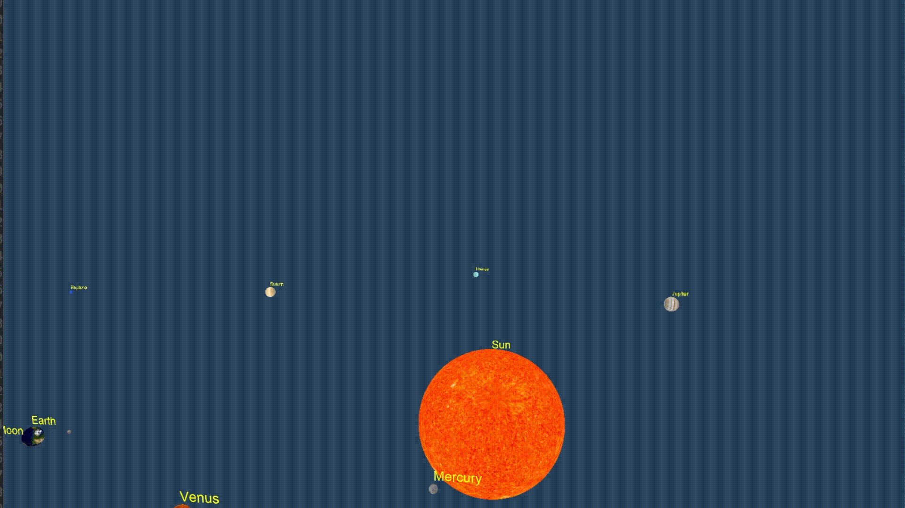
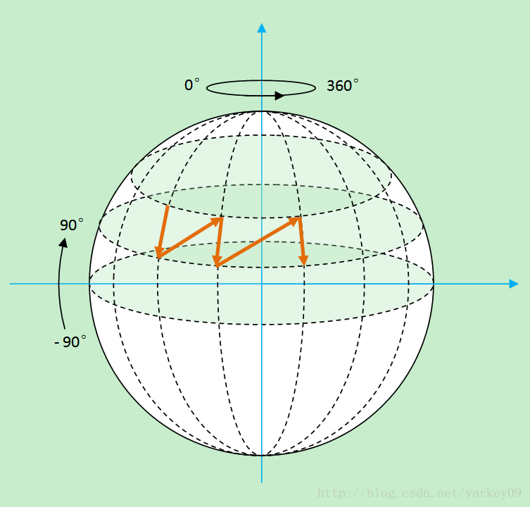
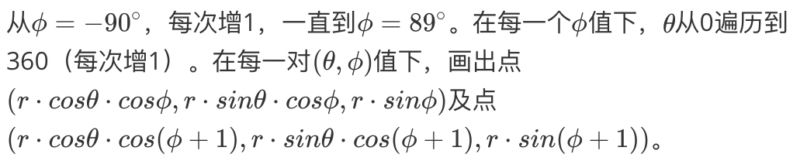

## 行星绕太阳



#### 作业要求

* 自己设定行星的运动轨道和大小以及纹理贴图（参考贴图见附件）

* 添加键盘控制，如方向右键增大沿x轴旋转速度
* 添加字体效果显示行星的名字，字体随着行星运动而运动

#### 实现过程

##### 行星旋转

* 在include/rotate.h中，定义了Rotation类，其中有各个星球的初始位置`std::vector<glm::vec3> Positions`、旋转速度`GLfloat orbitRotateSpeed[10]`和旋转角度`GLfloat orbitAngle[10]`（这里没有加入星球的自转），还有星球半径的变化比`std::vector<GLfloat> Radius`。

* 每一帧主函数会调用一次Rotation中的`PositionUpdate(GLfloat deltaTime)`，使各个orbitAngle根据对应的orbitRotateSpeed增加。

* 注意月球的旋转！Rotation类中定义的月球初始位置、旋转速度、旋转角度均是以地球为参考系，在主函数中根据现在旋转角度计算各星球当前位置的代码如下：

  ```C++
  model = glm::mat4(1);
  // put the matrix by reversed order
  if (i == 4){ // Moon
    model = glm::rotate(model, glm::radians(rotation.orbitAngle[3]), glm::vec3(0.0f, 1.0f, 0.0f));
    model = glm::translate(model, rotation.Positions[3]);
    // ... 关于文字的部分省略
  }
  model = glm::rotate(model, glm::radians(rotation.orbitAngle[i]), glm::vec3(0.0f, 1.0f, 0.0f));
  model = glm::translate(model, rotation.Positions[i]);
  // ... 关于文字的部分省略
  GLfloat scaleTime = rotation.Radius[i];
  model = glm::scale(model, glm::vec3(scaleTime, scaleTime, scaleTime));
  // Get the uniform locations
  GLint modelLoc = glGetUniformLocation(ourShader.Program, "model");
  // Pass the matrices to the shader
  glUniformMatrix4fv(modelLoc, 1, GL_FALSE, glm::value_ptr(model));
  ```

  月球应该先在地球参考系下平移并旋转，再利用地球在太阳参考系下的数据再次进行平移并旋转（注意OpenGL的变换矩阵是利用栈存储的，所以在写的时候要逆序）

##### 球体的生成

* 球体按球坐标生成，参考了[这里](https://blog.csdn.net/xufan123123/article/details/72667882)的方法，如下图所示。



* 在src/main.cpp中的void generateSphere函数中进行。（默认半径是0.5，流程如下）最后按照`GL_TRIANGLE_STRIP`画三角形。

##### 文字添加

* 文字通过FreeType库添加，使用不同的shader。主要注意在文字和图像之间转换时shader，VAO，texture的激活。

##### 主要源代码文件

- src/main.cpp（绘图主程序）

- include/rotate.h（Rotation类的实现）

- config/main.vert.glsl & main.frag.glsl & text.vert.glsl & text.frag.glsl（着色器）

- 采用cmake编译，macOS Mojave

##### 依赖文件

* include/glad.c

* include/glad/glad.h

* include/KHR/khrplatform.h

* include/glm/*

* include/shader.h

##### 依赖的库

* glfw

* SOIL
* FreeType2

* Carbon, IOKit, ForceFeedback, Cocoa, CoreVideo, OpenGL, CoreFoundation (MacOS)