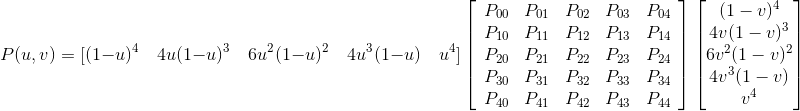

## *Bezier*曲面

#### 作业要求

* 使用25(5×5)个控制点
* 使用细分控制着色器TCS设置细分等级
* 使用细分控制着色器TES根据贝塞尔曲面的数学方程计算新顶点坐标、纹理坐标
* 添加键盘控制改变曲面的平滑度，支持线框模式显示
* 为贝塞尔曲面进行纹理贴图，自选纹理图片

#### *Bezier*曲面的生成

* 25个控制点的*Bezier*曲面方程为
* 把细分参数通过uniform变量level传给TCS着色器，改变细分等级。由键盘X，Z控制改变平滑度；C控制是否以线框模式显示。
* 定义25个坐标点，传给TES着色器作为25个P点，根据上述方程编写着色器。
* texture.png为所用的纹理图片。

