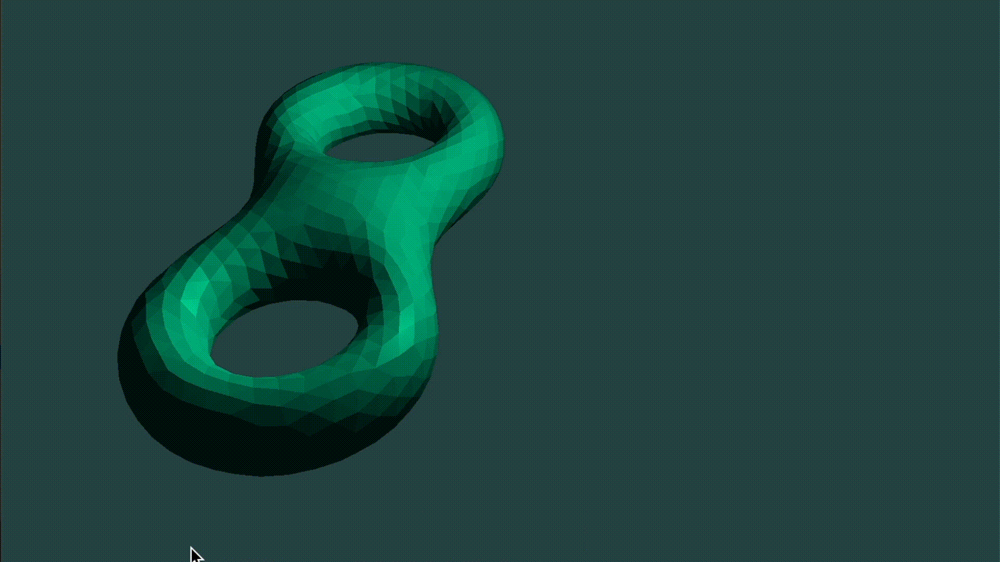

## 光照效果



#### 作业要求

* 读入三维模型，对读入的模型使用鼠标进行旋转、缩放

* 利用光照模型实现简单的光照效果，使用物体材质和环境光、漫反射、镜面反射结合产生光照效果

* 与作业1不同，不再要求面片模式下各个面的颜色不同，面片模式下各个面用同一种颜色。

#### 实现过程

##### 点、面、法向量的读取和生成

1. 点和面从obj文件中读取，最终生成的vector vertices中，每三个vec3的点代表一个面。
2. 由于obj文件没有给出法向量及其方向，所以我直接默认所给出的点都是按逆时针给出的，即<a href="https://www.codecogs.com/eqnedit.php?latex=\overrightarrow{n}&space;=&space;\overrightarrow{V_3&space;V_2}&space;\times&space;\overrightarrow{V_3V_1}" target="_blank"></a>，存储在`std::vector<glm::vec3> normals`中，使用时要利用VBO重新生成buffer，依旧绑定在相同的VAO下。

##### 光照的实现

光照涉及环境光、漫反射光、镜面反射光。

* 环境光直接在片段着色器中实现，利用光的颜色与常量环境因子相乘。
* 漫反射光，利用光线与之前计算的法向量计算二者夹角计算光强等参数，同时与眼睛位置有关，在顶点着色器中计算世界坐标系的法向量后，在片段着色器中根据之前的计算结果以及光照颜色得到因子。
* 镜面反射光由光线方向向量和法向量计算得到，同时考虑反射光是否在视线范围内。

##### 键盘及鼠标控制

* 键盘WSADQE分别控制模型前后左右上下移动，鼠标上下左右移动可以控制模型上下左右旋转，鼠标滚轮控制缩放。
* 初始颜色为深绿色(0.2f,0.8f,0.6f)，之后通过键盘按下RGB键，每按一次相应的值增加，实现颜色的变化。

##### 主要源代码文件

- src/main.cpp（绘图主程序）
- camera.h为助教所给
- config/main.vert.glsl & main.frag.glsl

##### 编译及运行

* 采用cmake编译，macOS Mojave

* 编译方式

  ```shell
  mkdir build
  cd build
  cmake ..
  make
  ./assignment7 # run the executable file
  ```

##### 依赖的文件

* include/glad.c
* inglude/glad/glad.h
* include/KHR/khrplatform.h
* include/glm/*
* include/shader.h

##### 依赖的库

* glfw
* Carbon, IOKit, ForceFeedback, Cocoa, CoreVideo, OpenGL, CoreFoundation (MacOS)